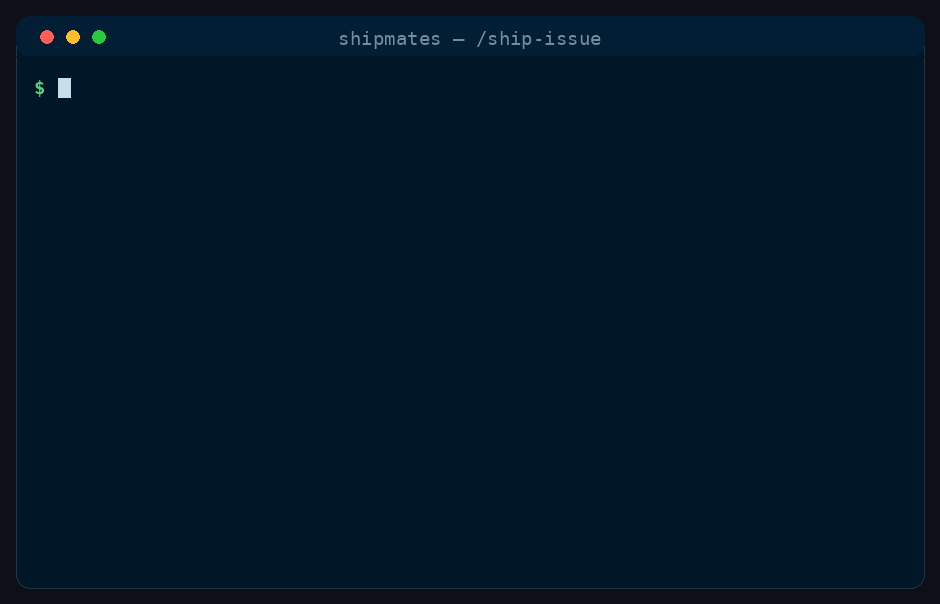

<p align="center">
  
</p>

# 🚢 Shipmates

<p align="center">
  <b>Custom subagents &amp; command workflows — for <a href="https://claude.com/product/claude-code">Claude Code</a>, opencode, Antigravity CLI, Codex, Cursor, GitHub Copilot, Windsurf, and Zed.</b><br/>
  A crew of specialist AI agents that drives a GitHub issue from open to a <b>reviewed, CI-green pull request</b> — autonomously.
</p>

[](LICENSE)
[](https://claude.com/product/claude-code)
[](https://saman-mb.github.io/shipmates/)
[](#-meet-the-crew)
[](CONTRIBUTING.md)
[](https://github.com/saman-mb/shipmates/stargazers)
[](https://github.com/saman-mb/shipmates/commits/main)
[](https://github.com/saman-mb/shipmates/issues)

<p align="center">
  
</p>
<p align="center"><sub><i>Illustrative — the actual stages <code>/ship-issue</code> runs, in order.</i></sub></p>

### Stop being your AI's for-loop. Give it a crew. ⚓

You know the drill: prompt, read the reply, prompt again, sigh, prompt again. **You** are the
control loop — the planner, the reviewer, the nagger. Shipmates hands that job to a *crew* of
specialist subagents and a workflow that actually finishes things.

One command — **`/ship-issue`** — takes a GitHub issue from *"open"* to a *reviewed, CI-green pull
request*, on its own: it plans the work, builds it in an isolated worktree, waits for CI to go
green, convenes an adversarial review board, loops on the fixes, and hands you a PR to merge.
You stay the captain. The shipmates do the twenty steps in between. 🫡

**[⚓ Get the crew aboard →](#-come-aboard-install)** · one line, no clone — then just `/ship-issue 42`.
<br/>🌐 **[shipmates website →](https://saman-mb.github.io/shipmates/)** · the crew, the commands, and how `/ship-issue` works.

---

## 🧭 Meet the crew

Twelve **domain-neutral** specialists. They'll work on *anything* — a game engine, a web app, a CLI —
because the standard they hold your work to comes from **your** repo's `README` / `CLAUDE.md`, not
from anything hardcoded into the role.

| Shipmate | Rank & duty |
|---|---|
| 🏛️ `architect` | Structure & schema — coupling, boundaries, migration safety, "does this actually fit?" |
| 🔧 `senior-engineer` | Builds to spec, fixes red CI, clears review defects |
| 🧪 `sdet` | Runs the real tests/build and reports pass/fail with a proper defect list |
| 🛡️ `security-engineer` | Threat-models the change — authz, injection, secrets, crypto, vulnerable deps |
| 🚨 `site-reliability-engineer` | Reliability & failure modes, rollback/deploy safety — and bug root-cause |
| ⚡ `performance-engineer` | Profiles, benchmarks, and *proves* the win — measure → optimise → measure |
| 📦 `devops-engineer` | Build & delivery — reproducibility, pinning, environment parity, does the gate gate? |
| 📋 `product-manager` | Accepts or rejects against the acceptance criteria **and** your quality bar |
| 🎛️ `ux-ui-designer` | Specs & reviews on-screen UI — tokens, responsive layout, focus, a11y |
| 🎨 `art-director` | Directs & reviews *rendered* visuals — judges the picture, not the code that drew it |
| 📖 `technical-writer` | Writes docs from the real code; proves them with a fresh-reader test |
| 📊 `data-scientist` | Data/model work — metric choice, leakage & validation, reproducibility (domain-gated) |

## 📜 The commands

| Command | What it does |
|---|---|
| `/ship-issue <n>...` | Drives GitHub issue `#n` — or several at once, bundled into one PR — from open → reviewed, CI-green PR (→ merged, opt-in), with the whole crew |
| `/fix-bug <n>` | Fixes a bug the honest way — reproduce as a failing test first, root-cause, minimal fix, red→green proof |
| `/plan-epics <brief>` | Turns a brief (or several) into GitHub epics + linked, labelled user stories, authored in parallel |
| `/harden <surface>` | Threat-models a surface and ranks every finding — read-only by default; remediation on a branch, opt-in |
| `/spike <question>` | De-risks a decision — prototypes the options in parallel, judges them, records the pick as an ADR |
| `/migrate <from→to>` | Sweeps a mechanical migration across the codebase — every call site, verified, no remnants left |
| `/document <target>` | Writes docs from the real code, gated on a *fresh reader* actually completing the steps |
| `/release [version]` | Cuts a release — changelog from what merged, CI-green tag, SRE rollback pre-flight, opt-in publish |
| `/polish <target>` | Iterates a visual/UI/output artifact to a specialist's sign-off — render → critique → fix loop |
| `/pr-review <pr>` | Runs the board against a PR the crew didn't author — read-only, it reports and never repairs |
| `/onboard [path]` | Reads an unfamiliar repo and writes the agent-facing context file the whole crew runs on |
| `/refactor <target>` | Reshapes code without changing behaviour — characterization tests pinned first, then proved |

**Where a command writes.** Anything that changes your repo does it on its own branch, in its own
worktree, and hands you a pull request — your checkout is left as you left it. `/release` is the one
exception: the release commit has to land on the branch being tagged, so it commits, pushes and tags
straight in your checkout instead of an unmerged side branch. `/pr-review` and `/harden`'s default
`report` mode write nothing at all. Writing straight into the working tree is opt-in
(`MODE=edit-in-place`); so are merging (`MERGE_MODE=auto`) and publishing (`PUBLISH_MODE=auto`).

**There's deliberately no `code-reviewer`.** Review is split by discipline instead of pooled into one
generalist: `architect` takes structure, `sdet` takes verification, `product-manager` takes acceptance,
`security-engineer` takes threat modelling, `devops-engineer` takes delivery. Line-level craft — naming,
dead code, error handling — is `senior-engineer`'s as it builds and `architect`'s on review. If you're
arriving from another agent pack that ships a `code-reviewer`, reach for one of those instead: an
unresolved role name silently falls back to a generic agent rather than erroring.

*More crew and more commands are on the way.* ⛵

---

## 🧰 The tools

Beyond the crew and the commands there's a third kind of resource: **tools**. A command is
something *you* invoke with a slash. A tool is something the *crew* reach for on their own,
implicitly, when the intent of your prompt calls for it — never typed, never a slash command.

| Tool | What it does |
| --- | --- |
| `termgif` | Renders a polished animated terminal demo GIF of a workflow run from a small JSON spec |

Tools are **opt-in** — a plain install ships only the crew and the commands. Add one with
`--with-tools` (below). Each tool maps to its harness's own native tool surface: a genuine code
tool on opencode (`.opencode/tools/<name>.ts`), and an agent-invoked Agent Skill everywhere else —
on Claude Code pinned agent-only with `user-invocable: false`, so it never appears as a slash
command. Defined once in `toolbox/<name>/`, exactly like the crew and commands.

*More tools are on the way.* ⛵

---

## ⚓ Come aboard (install)

`shipmates` is a single Rust binary. Grab it any way you like:

**macOS / Linux (Homebrew):**
```bash
brew install saman-mb/tap/shipmates
```

**Anywhere (Cargo):**
```bash
cargo install shipmates
```

**Binary Installer (cargo-dist):**
```bash
curl --proto '=https' --tlsv1.2 -LsSf https://github.com/saman-mb/shipmates/releases/download/vX.Y.Z/shipmates-installer.sh | sh
```

Then install the crew for a harness. By default it drops into the current directory; pass `--dir`
to target a specific project:

```bash
shipmates install --harness claude-code     # the proven target
shipmates install --harness opencode        # format-verified, not runtime-verified
shipmates install --harness codex
```

Tools are off by default — add one (or `all`) with `--with-tools`:

```bash
shipmates install --harness claude-code --with-tools termgif
shipmates install --harness opencode --with-tools all
```

Which harnesses can you install? `shipmates targets` lists them — today all of:

```
claude-code      .claude/          agents + skills
opencode         .opencode/        agents + commands
antigravity      .agents/          agents + skills   (agy — the successor to the retired Gemini CLI)
codex            .codex/ + .agents/  crew (TOML) at .codex/agents, skills at .agents/skills
cursor           .cursor/          skills only
github-copilot   .github/          crew + skills
windsurf         .windsurf/        skills only
zed              .agents/          skills only (open Agent Skills standard)
```

Every harness compiles the same canonical crew and commands. Five have a native subagent directory
and receive the twelve specialists as agents; the other three ship the crew as twelve skills only.
One caveat worth knowing before you pick Codex: it documents no per-agent tool allowlist, so its
crew inherit whatever the session can do rather than the least-privilege set every other target
enforces. Each harness records its evidence, and the date it was checked, in
`tools/harness_matrix.json`. Installing never touches your working tree — anything that
changes a repo does so on a branch — and `shipmates uninstall` is not (yet) implemented; delete the
tree the harness installed instead.

**Why opencode gets `commands/` and not `skills/`.** opencode has both, and they are not the same
thing: its *skills* are model-invoked — it loads one on demand through a native `skill` tool — and
`disable-model-invocation` is not a frontmatter key a `SKILL.md` recognises there, so declaring it
would be silently dropped. The twelve create worktrees, push branches and open pull requests, so
shipping them as skills would let the model start one unprompted. `commands/` is `/`-invoked only,
which keeps user-invoked-only structural rather than dependent on a key the target ignores.

**Least privilege still holds, by inversion.** opencode's defaults are permissive — effectively
`"*": "allow"` — so listing the tools a role needs would grant nothing. Each generated agent emits
a `"*": deny` catch-all first and its specific allows after; opencode resolves permissions
last-match-wins, so the ordering is the mechanism. The result is marginally stronger than Claude's
allowlist: a tool a wildcard denies is hidden from the model rather than refused at call time.

> ⚠️ **Only Claude Code is runtime-verified.** Every other target's payload was checked against the
> harness's own parsing source and first-party docs, not by installing and running it. Whether agents
> resolve, whether argument passing behaves, and whether `/ship-issue` completes end to end are open
> on those targets — for opencode, tracked in
> [#31](https://github.com/saman-mb/shipmates/issues/31) and
> [#32](https://github.com/saman-mb/shipmates/issues/32).

> 🔁 First time a `skills/` or `agents/` dir got created? Restart your harness so it spots them.

### The exporter foundation

Portability work starts from the canonical `commands/` and `crew/` sources: full persona/workflow
bodies, semantic crew capabilities, and harness-neutral prose that names abstract locations
(`agent-files/*.md`, `Harness-Session`) and `{{arguments}}` instead of any harness's dialect. A
per-harness **render layer** rewrites that prose into each harness's real dialect — where its agents
live, what its session metadata is called, which project-instructions file it reads (`CLAUDE.md`,
`AGENTS.md`), and how a role is spawned — and an adapter emits the harness's frontmatter shape.
The published site is generated from the **rendered** Claude Code payload, never the neutral source.

Build, check, or regenerate the reference digests:

```bash
cargo run -- build --target claude-code --out /tmp/shipmates-build
cargo run -- check --target claude-code
cargo run -- build --target claude-code --update   # regenerate reference digests
```

`tools/capability_registry.json` is the semantic-to-harness tool map — including the `scopes` map
each adapter uses to honour role-level refinements. `art-director` declares `web-scopes: search`
once, and gets `WebSearch` without `WebFetch` on Claude Code and `websearch: allow` without
`webfetch` on opencode. `tools/manifest.json` declares every implemented target; an unknown target
is refused on that declared status, not on a hardcoded name in the exporter.

## 🚀 Weigh anchor (use it)

```
/ship-issue 42
```

Then go get a coffee ☕. It plans, spins up a worktree, builds, waits for CI to go green, convenes
the board, loops on fixes, and hands you a reviewed PR. By default it **stops at the PR** for you to
merge — set `MERGE_MODE=auto` if you want it fully hands-off in a repo where that's fair game.

---

## 🛠️ How the voyage works

`/ship-issue` isn't a clever prompt — it's a **state machine with gates**:

1. **Plan** 🗺️ — a planner reads the issue + your docs → build plan, acceptance criteria, validation
   plan, and flags for which specialists this story needs.
2. **Design specs** ✏️ *(only if needed)* — for UI / visual / architecture-heavy stories, the right
   specialist writes a spec the builders must build to.
3. **Isolate** 📦 — all work in a throwaway `git worktree`; your base branch never breaks.
4. **Build** 🔨 — parallel `senior-engineer` builders with non-overlapping file ownership.
5. **Self-check → CI gate** 🚦 — the SDET runs the tests; then **CI must go green** on the pushed PR
   before anything moves on. Red? It reads the logs and fixes — bounded to a few rounds.
6. **Acceptance board** ⚖️ — `product-manager` + `sdet` (+ gated `ux-ui-designer` / `art-director` /
   `architect`) review the *pushed PR head*, independently and adversarially.
7. **Remediate** 🔁 — any rejection loops back to a fixer, then re-reviews. Bounded, then escalates.
8. **Deliver** 🏁 — files the non-blocking nits as follow-ups, names a `/harden` follow-up if the
   change touched a security-relevant surface (this board doesn't threat-model), and opens (or,
   opt-in, merges) the PR.

The tricks that make the loop hold together:

- 🎯 **An explicit state machine, not a wish.** Stages converge; "go fix it" drifts.
- 📦 **An isolated sandbox.** Autonomy is only safe when the blast radius is zero.
- 🚦 **Objective gates over vibes.** Green CI beats "looks done to me."
- 👥 **Reviewers can't grade their own homework.** A *fresh* agent reviews the PR — never the builder.
- ⏱️ **Bounded loops.** Retry N, then tap the human. A loop with no cap just spins.
- 🎟️ **Capture, don't block.** Nits become tickets, not roadblocks.

## 🧭 Examples — putting the crew to work

**Ship a single ticket, hands-off to a reviewed PR:**
```
/ship-issue 142
```
The planner reads issue #142 and your README; a `senior-engineer` builds it in a worktree; CI has to
go green; then a `product-manager` and `sdet` review the pushed PR — a `ux-ui-designer` or `art-director`
joins automatically if the story is UI or art. Fixes loop until they pass, and you get a reviewed PR
to merge.

**Ship it fully autonomously (merge included), where that's acceptable:**
```
MERGE_MODE=auto /ship-issue 142      # or just say "auto-merge" in the prompt
```

**Turn a one-line brief into a tracked backlog:**
```
/plan-epics "User accounts: signup, login, password reset, and a profile page"
```
A `product-manager` scopes it into an epic, drafts INVEST user stories with acceptance criteria, and
files them as linked, labelled GitHub issues — ready to hand to `/ship-issue` one at a time.

**Break a big vision into several epics at once (fan-out):**
```
/plan-epics ./docs/product-brief.md
```
When the brief spans multiple epics, one `product-manager` subagent per epic drafts its stories in
parallel, then everything is created and cross-linked.

**Preview a backlog without creating anything:**
```
/plan-epics "checkout + payments + order history"  — dry run
```

**Polish a UI screen until it's actually right:**
```
/polish the settings screen
```
The `ux-ui-designer` reviews the *rendered* screen (not the code), lists concrete fixes, a
`senior-engineer` applies them, it re-renders, and the loop repeats until the designer signs off — or
hands you the outstanding notes after a few rounds. It never writes to your checkout: it decides
where the polish should *land*, not where you happen to be standing. Already inside a worktree — the
one `/ship-issue` left behind, say — it stays put and reuses it, refusing if the tree is dirty. On a
feature branch whose PR is already open, it works in a detached worktree and pushes back onto that
branch, so the polish joins the PR you already have instead of opening a second one. Otherwise it
cuts a `polish/<slug>` branch from `HEAD` and opens a PR of its own.

**Polish rendered art the same way:**
```
/polish the title-screen background — reviewer: art-director
```
Same loop, but the `art-director` judges the actual render — palette, composition, contrast — round after
round until it meets the bar.

**Fix a bug — proven, not just patched:**
```
/fix-bug 213
```
A failing regression test is written *first* to reproduce #213; a `senior-engineer` root-causes and fixes
it; the test flips red→green while the suite stays green; a fresh reviewer confirms it's the root cause,
not the symptom. You get a PR with the proof attached.

**Threat-model and harden a surface:**
```
/harden the auth + session flow
```
The `security-engineer` walks it with STRIDE / OWASP and ranks findings by severity with the exploit path.
That pass is **read-only** — it reports, it doesn't touch your tree. Ask for the fixes (`MODE=pr`)
and a `senior-engineer` remediates the blockers on a branch, re-reviewing until nothing Critical/High is
left open, then hands you a CI-gated PR.

**De-risk a decision before committing to it:**
```
/spike "job queue: Redis vs Postgres vs SQS"
```
Engineers prototype each option in parallel as throwaways, an `architect` judges them against your real
constraints (weighing reversibility), and you get a recommendation recorded as an ADR — not a hunch.

**Sweep a migration across the whole codebase:**
```
/migrate "moment.js → date-fns"
```
Every call site is inventoried, transformed in isolation, verified, and the run only closes when a re-grep
for the old pattern comes back empty and the suite is green. Nothing left half-migrated.

**Write docs that actually work:**
```
/document the getting-started guide
```
The `technical-writer` drafts from the real code, then a *fresh* agent follows the steps against the repo
like a newcomer — the docs ship only once that reader reaches the result. No drift, no dead ends.

**Cut a release safely:**
```
/release minor
```
The changelog is assembled from what actually merged, the version is bumped, CI must be green on the exact
tagged commit, and the `site-reliability-engineer` checks rollback + migration safety before it's tagged.

**Chain them — scope the work, ship a story, polish its UI:**
```
/plan-epics "settings redesign"     # → creates the epic + stories
/ship-issue 148                     # → builds & reviews one story to a PR
/polish the settings screen         # → iterates the visuals to sign-off
```
Run that third step **from the worktree `/ship-issue` left behind** (`../<repo>--issue-148`), so the
polish lands on the same branch. Started from your base branch, `/polish` would begin from a baseline
that doesn't contain the new screen yet.

## 🗂️ Scopes & precedence

**In Claude Code**, both `~/.claude/` (global, every project) and `<repo>/.claude/` (that project
only) are loaded. The two halves of the crew then resolve a name clash in **opposite** directions:

- **Subagents — the project copy wins.** `<repo>/.claude/agents/architect.md` overrides
  `~/.claude/agents/architect.md`, so any repo can specialise a crew member without touching the
  shared copy.
- **Skills — the personal copy wins.** `~/.claude/skills/ship-issue/SKILL.md` overrides
  `<repo>/.claude/skills/ship-issue/SKILL.md`. If you have installed globally *and* into a project
  (via `--dir`), the **global** command is the one that runs — uninstall the one you don't want
  rather than editing the loser.

A skill also beats a legacy `.claude/commands/<name>.md` of the same name.

Other harnesses resolve clashes on their own rules, so read this as a Claude Code fact, not a
universal one.

## 🎒 What you'll need

- A supported harness (Claude Code is the proven one; the others build and are format-verified)
- `git` + an authenticated [`gh`](https://cli.github.com/) CLI, for the GitHub flow
- A repo with CI (strongly recommended — the green-CI gate is what makes autonomy trustworthy)

## 💡 Why it's built this way

- **Agents are generic; your project supplies the bar.** No role name-drops a stack or product — it
  enforces whatever *your* README/CLAUDE.md says. That's what makes the crew reusable everywhere.
- **A loop is only as smart as its ground-truth signal.** Tests and CI are solid gates; taste isn't —
  so the visual specialists flat-out flag *"needs a human visual pass"* when they can't render.

## 🌊 On the horizon

**Where each harness stands.** Every target's payload is compiled and digest-checked in CI; the
question is whether it's been *run*.

- **Runtime-verified** — Claude Code: the full crew and all 12 commands, and the only harness
  Shipmates has actually been run on.
- **Builds, not runtime-verified** — opencode, Antigravity CLI, Codex CLI, Cursor, GitHub Copilot,
  Windsurf and Zed all build from `shipmates install --harness <name>`, and each payload's format was
  verified against that harness's parsing source and first-party docs. opencode and Antigravity get the full
  crew + all 12 commands; the other five have no native subagent directory, so they ship the 12 skills
  only. A live run has not been done on any of them; opencode's open questions are tracked in
  [#31](https://github.com/saman-mb/shipmates/issues/31) and
  [#32](https://github.com/saman-mb/shipmates/issues/32). The Gemini CLI is retired — the Antigravity
  CLI (`agy`) is its successor and reads `.agents/`, so that is the target Shipmates builds for.

Why that's credible: the crew's system prompts name no harness, and the twelve commands ship in the
[Agent Skills](https://agentskills.io) open-standard shape rather than a Claude-specific one — so most
of a port is mapping frontmatter fields and rendering dialect tokens, not rewriting the crew. The
opencode adapter is the first test of that claim: it reused every persona and workflow body unchanged,
and the work that remained was path mapping and translating Claude's tool allowlist into opencode's
permission map.

The crew also keeps signing on (a `data-engineer`, an `ml-engineer`, a `mobile-engineer`…) and new
commands keep shipping. Want a role or a workflow aboard? Open an issue — ideas and PRs very welcome.

## ❓ FAQ

**What is Shipmates?**
A ready-made crew of **subagents** and **command workflows**. Instead of you playing
planner–builder–reviewer in a loop, a board of specialist AI agents does it — the flagship
`/ship-issue` takes a GitHub issue all the way to a reviewed, CI-green pull request. It ships for
eight harnesses — Claude Code, opencode, Antigravity CLI, Codex, Cursor, GitHub Copilot, Windsurf, and Zed;
see [on the horizon](#-on-the-horizon) for where each harness stands.

**What are Claude Code subagents and skills?**
Subagents are focused AI agents defined in `.claude/agents/*.md`; skills are reusable workflows defined
in `.claude/skills/<name>/SKILL.md` and invoked as commands, like `/ship-issue`. Shipmates ships 12 agents
and 12 commands you drop into a repo's `.claude/` with `shipmates install` (or `.opencode/` for opencode,
`.codex/` for codex, and so on). See [install](#-come-aboard-install).

**Is this an official Anthropic project?**
No. Shipmates is an independent, MIT-licensed community project that builds on Claude Code's public
subagent and skill features. "Claude" and "Claude Code" are trademarks of Anthropic.

**How is it different from just prompting Claude Code?**
A raw prompt drifts; Shipmates is a **state machine with gates** — an isolated worktree, a mandatory
green-CI gate, and a *fresh* reviewer that never grades its own work — so an autonomous run converges
instead of wandering. See [how the voyage works](#-how-the-voyage-works).

**Which languages and frameworks does it work with?**
Any. The agents are **domain-neutral** — they enforce the standard in *your* repo's `README` / `CLAUDE.md`,
so the same crew works on a game engine, a web app, or a CLI.

**Do I have to configure each agent?**
No. Install once, then `/ship-issue 42`. The crew picks up your project's quality bar automatically;
a project-level `.claude/agents/` definition overrides the global one when you want to specialise a
crew member. Skills go the other way — see [scopes & precedence](#-scopes--precedence).

## 🤝 Contributing

See [CONTRIBUTING.md](CONTRIBUTING.md). The one hard rule: **keep agent roles domain-neutral** so
they sail on anyone's project.

## 📄 License

[MIT](LICENSE) — take it, fork it, crew up. 🚢
