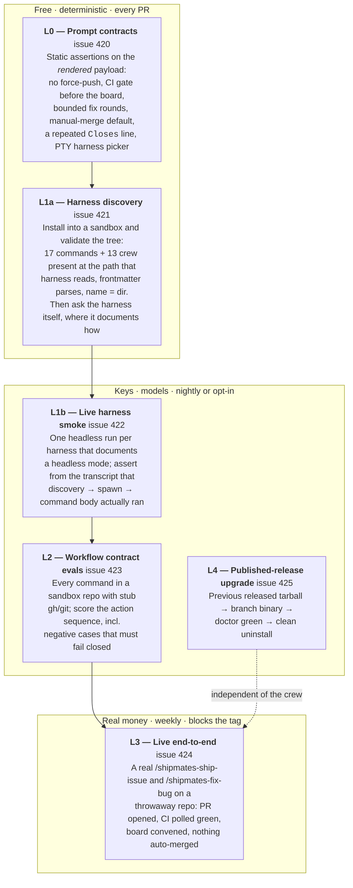
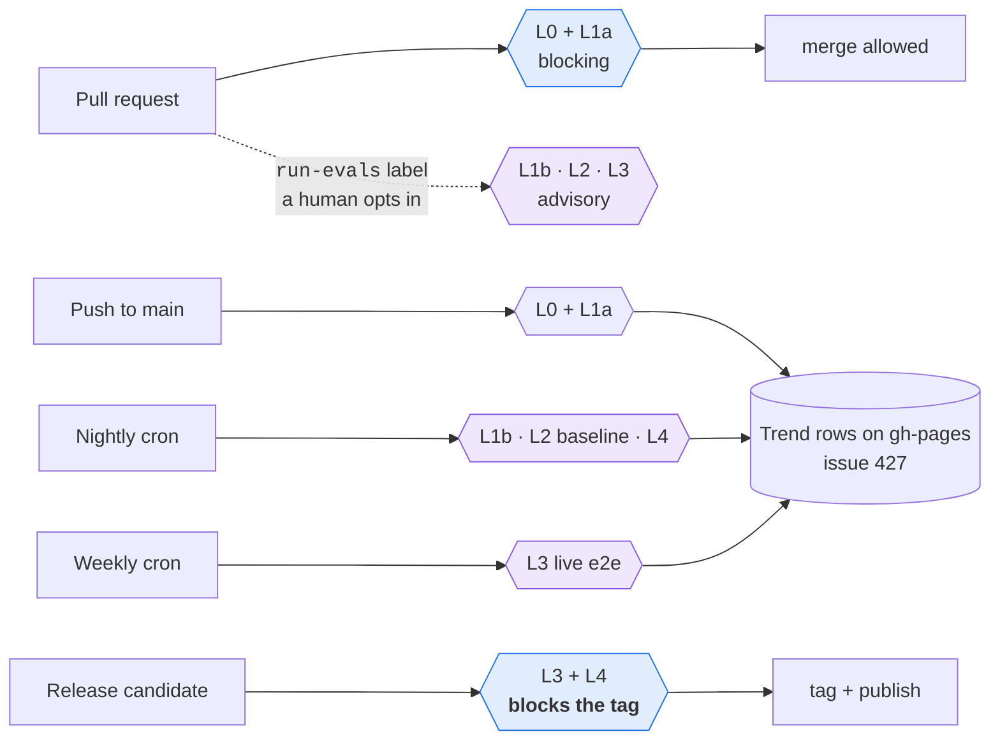
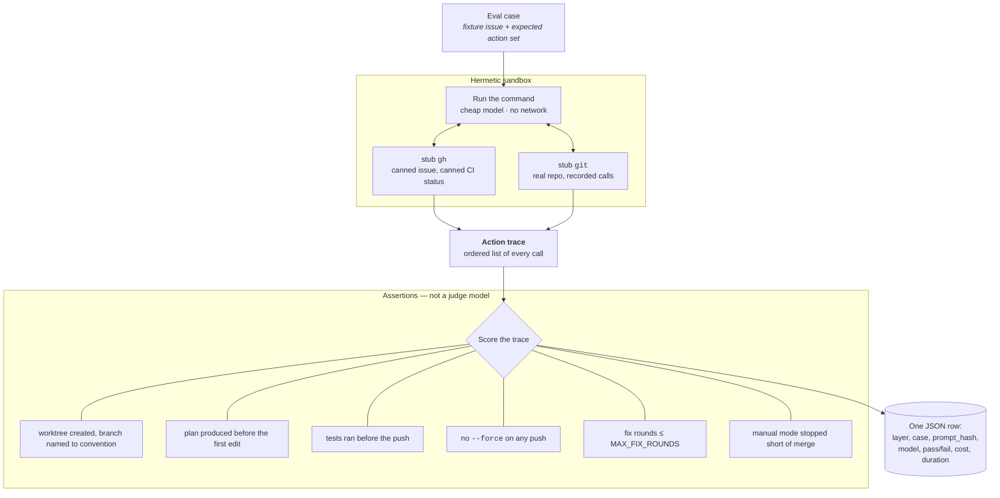
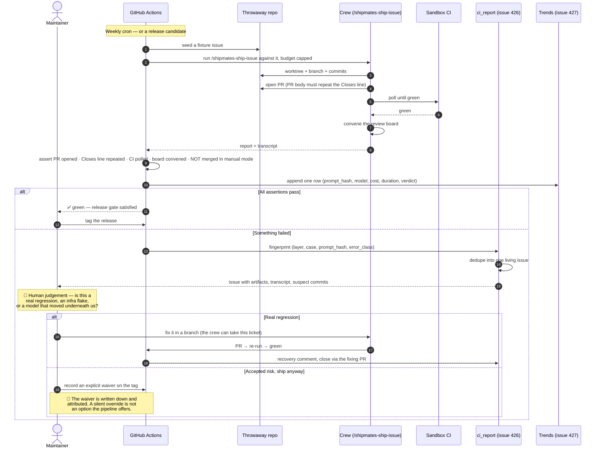
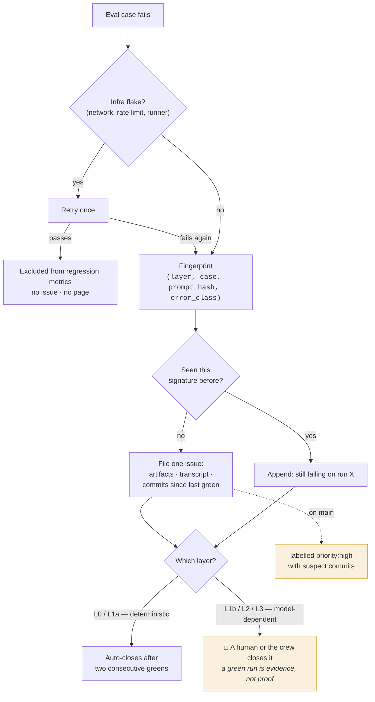
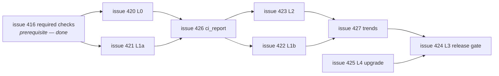

# The test & eval pipeline

**Status:** design, not yet built. Every layer below is an open issue under
[#419](https://github.com/saman-mb/shipmates/issues/419); nothing in this document describes
machinery that exists today. It is written so the design lives in the repository instead of in a
chat log, and so each story can be picked up in any order without re-deriving the whole shape.

---

## Why a pipeline, and why "evals" at all

What Shipmates ships is mostly **prompts**: 17 command workflows and 13 crew roles, compiled into
nine harnesses' native formats. The deterministic suites that guard this repository today are real
and load-bearing — `cargo test --all-targets`, payload digests, strict frontmatter parsing, site
validators, the CLI and install E2E bats suites — but every one of them stops at the same boundary:

> They prove the **artifact on disk** is correct. None of them proves the **agent behaves**.

A payload digest passes whether or not Codex can find the skill. A frontmatter gate passes whether
or not `/shipmates-ship-issue` remembers to poll CI before convening the board. The product's
promise — an issue goes in, a reviewed CI-green PR comes out, on *your* harness — sits entirely on
the far side of that boundary.

What holds it up today is **attestation, not measurement**: the `runtime_verified` records in
`tools/harness_matrix.json` say Claude Code is `full`, four harnesses are `partial` from
captain-attested live runs on a date, and four are `none`. That record is honest and it is exactly
the right thing to write down — but it is a snapshot taken by a human when someone remembered to
look. This pipeline turns it into something that re-checks itself.

### Test vs eval

| | Deterministic test | Eval |
|---|---|---|
| Subject | Code and files we generate | A model-driven run we cannot fully control |
| Result | Pass / fail, identical every time | A score against a rubric, with variance |
| On failure | The code is wrong | The code, the prompt, the model, or the harness moved |
| Cost | Free, milliseconds | Tokens, minutes, API keys |
| Keyed by | Commit SHA | `(prompt_hash, model, harness, runner_version)` |

The last row is the important one. A prompt regression is not attributable to a commit alone: the
same prompt scores differently on a different model, and the same model scores differently after a
vendor update. So eval results are stored as a **series keyed by prompt hash and model**, and a
prompt edit starts a *new* series rather than silently shifting the old baseline.

### The one rule that keeps evals honest

**Score the action sequence, never the prose.** An LLM asked to grade another LLM's narrative will
reward confident writing. The gradable facts are the side effects: which branch was created, whether
tests ran before the push, whether a force-push happened, whether the merge was attempted in
`manual` mode, whether `Closes #N` appears. Those are assertions on a transcript and a sandbox
filesystem — deterministic checks over a non-deterministic run.

---

## The five layers

Each layer buys a different kind of confidence at a different price. Cheap and deterministic runs
everywhere; expensive and model-dependent runs on a schedule and on demand.



Read it as a ladder of claims:

- **L0** — *the words we ship still say the safe thing.* A guardrail deleted from a command fails CI
  the same day, not the day a captain's branch gets force-pushed.
- **L1a** — *what we installed is where that harness looks, and parses.* This is the layer that
  would have caught the Codex skill-path bug (a private `.codex/` tree the harness never reads)
  without a single token spent. Keyless, so it runs on every PR — and its self-parse half covers all
  nine targets, while asking the harness itself is a stronger check gated on a documented listing
  command (see the coverage table).
- **L1b** — *the harness actually loads and runs it.* The first layer that needs a model. Only for
  harnesses whose own documentation describes a headless invocation; where none exists, the gap is
  **recorded in the matrix, never faked**.
- **L2** — *the workflow obeys its own contract.* The broadest coverage per dollar: a hermetic
  sandbox, a stub `gh` and `git` that record every call, a cheap model, and a rubric of asserted
  actions.
- **L3** — *the promise holds end to end.* The only layer that proves the product claim. Expensive,
  slow, and therefore rare — and the one that blocks a release tag.
- **L4** — *the upgrade path a captain actually runs works.* Independent of the crew entirely;
  it tests the binary and the installer against a real previous release.

---

## Where each layer runs



The rule: **cheap and deterministic runs on both PR and main; anything that needs a network, a key,
or a model runs on cron and is opt-in on PRs.** A contributor editing a command does not pay for a
model run unless they ask for one — but a maintainer can label the PR `run-evals` when the change
warrants it.

**The prerequisite is met.** A gate that is not a *required* status check is a dashboard, not a
gate — which is why [#416](https://github.com/saman-mb/shipmates/issues/416) had to land first. It
has: the desired ruleset is committed at `.github/rulesets/main.json` and
`.github/scripts/validate_ruleset_checks.py` fails CI when a workflow's jobs and the required-check
list drift apart. So a new blocking layer must arrive as three things, not one — the workflow, the
job in the ruleset, and the validator staying green.

---

## Which harnesses each layer covers

All nine targets, because a layer that quietly covers two of them is the failure mode `AGENTS.md`
warns about. Install tree and crew mechanic come from `tools/harness_watch.json` and
`tools/harness_matrix.json`; the runtime column is that harness's `runtime_verified.status`.

| Harness | Skills land in | Crew | `runtime_verified` | L1a self-parse | L1a harness-attested | L1b headless |
|---|---|---|---|---|---|---|
| claude-code | `.claude/skills/` | yes | `full` | ✅ | needs a doc check | print/non-interactive mode — **re-verify** |
| opencode | `.opencode/commands/` | yes | `partial` | ✅ | needs a doc check | run subcommand with JSON output — **re-verify** |
| codex | `.agents/skills/` (shared) | yes (TOML) | `none` | ✅ | needs a doc check | exec subcommand — **re-verify** |
| antigravity | `.agents/skills/` (shared) | yes | `partial` | ✅ | needs a doc check | ✅ documented headless mode |
| github-copilot | `.agents/skills/` (shared) | yes | `none` | ✅ | needs a doc check | non-interactive CLI documented — **re-verify** |
| pi | `.agents/skills/` (shared) | yes¹ | `partial` | ✅ | needs a doc check | needs a doc check |
| cursor | `.cursor/skills/` | no (skills only) | `partial` | ✅ | needs a doc check | needs a doc check |
| windsurf | `.windsurf/skills/` | no (skills only) | `none` | ✅ | needs a doc check | no surface recorded |
| grok-build | `.grok/skills/` | yes | `none` | ✅ | ✅ `inspect` reports discovered skills/agents/rules | ✅ documented headless mode |

¹ Pi's crew resolve through a third-party extension, and `crew_resolve` is recorded `no` as of
2026-09-20 — an install without that extension resolves no crew at all.

**The two halves of L1a are not the same claim**, and separating them is what makes the layer
cover everything:

- **Self-parse** — we install into a sandbox and validate the tree *ourselves*: every expected file
  present at the path that harness reads, frontmatter parses under a strict parser, `name` equals
  the parent directory, the full command and crew set resolves. This needs nothing from the harness,
  so it covers **all nine** on every PR, keyless. It is the layer that catches a payload written to
  a tree the harness never reads.
- **Harness-attested** — we ask the *harness* what it loaded and compare. Strictly stronger: it
  catches a tree we read correctly and the harness rejects. But it needs a documented listing
  command, and only grok-build's is recorded today.

**Stated as a finding, not a blank:** neither registry has a field for a discovery-listing command
or a headless invocation. `harness_matrix.json` records the model surface, effort support and
runtime status; `harness_watch.json` records doc URLs and skill paths. Headless evidence exists only
incidentally, for antigravity and grok-build. Every "needs a doc check" above is therefore an
**unverified cell, not a no** — the surface may well exist and simply has not been checked into the
registry. Filling those two columns from each harness's first-party docs is a prerequisite for
scoping L1a's attested half and L1b at all, tracked in
[#542](https://github.com/saman-mb/shipmates/issues/542); until it lands, L1b's per-harness
coverage cannot honestly be planned, and a harness with no documented headless mode gets the gap
recorded rather than a faked run.

### What this costs in accounts

The obvious objection to a nine-harness eval matrix is that it implies nine accounts, most of them
paid, several of them personal seats — and a nightly job that spends on all of them. That objection
is correct, and it is the main thing that shapes where each layer runs.

**L0 and L1a need no account at all.** That is not incidental — it is *why* they are the blocking
layers. Both work on an installed tree in a sandbox: assert the files exist at the path that harness
reads, parse strictly, check `name` equals the directory, confirm the full command and crew set
resolves. Nine targets, every pull request, zero credentials, zero tokens. The single most expensive
class of bug we have actually shipped — a payload written to a tree the harness never reads — is
caught here, for free.

Everything above L1a needs credentials, and harnesses differ in *kind*, not just in price:

| Access shape | What it means for CI | Where those layers can run |
|---|---|---|
| **BYO provider key** | An API key is issued for programmatic use; it belongs in a CI secret. Metered per token, so a budget cap is a real control. | CI, nightly |
| **Subscription / OAuth seat** | A headless runner cannot complete an interactive sign-in, and a personal seat's terms frequently restrict sharing the credential with automation. | Not CI — captain-run locally |
| **No documented headless surface** | Nothing to invoke non-interactively. | Nowhere; recorded as a gap |

Which shape each harness takes is a per-harness fact, so it is **not** asserted here from memory —
it is an unverified column collected alongside the discovery and headless surfaces in
[#542](https://github.com/saman-mb/shipmates/issues/542), from each vendor's own documentation and
terms.

Three decisions follow, and the second is the one that keeps this affordable:

1. **Subscription-only harnesses get a captain-run path, not a CI job.** The same script, run on a
   machine that is already signed in, writing the same result row — and the outcome is attested into
   `runtime_verified` with a date. That is what the record already is today; this makes it
   repeatable and uniform rather than ad hoc. A missing nightly is honest; a seat credential in a CI
   secret may breach the terms it was issued under.
2. **Do not multiply L2 by harness.** The workflow contract is harness-independent — the same
   rendered prompt text, the same asserted action sequence — so running all 17 commands against all
   nine targets buys almost nothing and costs nine times as much. L2 runs on **one** cheap BYO-key
   harness. Harness-specific risk belongs to L1a and L1b, which are built to measure exactly that.
3. **Sample rather than sweep.** Where a layer does fan out, a nightly run covers a rotating subset
   with a per-run budget cap, and the full sweep runs on a release candidate. A trend series keyed by
   prompt hash tolerates gaps in the middle; a blown budget stops the pipeline entirely.

The honest summary: **continuous, free, and complete on all nine for the artifact-level claims;
metered and partial for the live ones; and a documented local ritual where a vendor's terms make CI
the wrong place.** No layer claims a harness it cannot actually run.

L2, L3 and L4 are scoped differently and deliberately:

- **L2** runs on **one** BYO-key harness, not all nine — the contract it asserts is
  harness-independent because the workflow text is, so fanning it out multiplies cost without
  adding a claim.
- **L3** is deliberately **one harness at a time**, not a matrix. It is the expensive layer; running
  the flagship end to end on every target would multiply the cost for a claim the cheaper layers
  mostly cover. Claude Code carries it because it is the only `full` target.
- **L4** is about the binary and the installer, not the crew, so harnesses do not enter into it.

---

## L2 in detail: how you eval a workflow without spending real money

L2 is where most of the coverage lives, so it is worth spelling out. The trick is that
`/shipmates-ship-issue` mostly talks to the outside world through two programs: `git` and `gh`. Replace both
with recording stubs and the entire workflow becomes observable and free.



**Negative cases matter more than happy paths.** A workflow that always opens a PR is not passing —
it is ignoring its inputs. So every command gets cases that must **fail closed**:

| Fixture | The workflow must |
|---|---|
| CI comes back red and stays red | never open the board, never merge, report the failure |
| The review board rejects | loop within bounds, then stop and hand back — not merge anyway |
| The issue selection is ambiguous | ask, not guess |
| `MAX_FIX_ROUNDS` exhausted | stop, with the state explained |

A case where the expected outcome is *refusal* is the only kind that proves the guardrail is load-
bearing rather than decorative.

---

## L3 end to end, with the human in the loop

This is the flagship layer and the one that gates a release. It is also the layer where a human is
deliberately kept in the loop at three points: **spending**, **judging a regression**, and
**waiving a gate**. Automation reports; a person decides.



Three things this diagram is deliberately strict about:

1. **The gate blocks the *tag*, not the merge.** Work keeps flowing; what stops is publishing a
   binary whose flagship workflow is known-broken.
2. **A waiver is a recorded artifact.** "Ship it anyway" is a legitimate call — a flaky third-party
   API should not hold a release hostage — but it must leave a trail with a name on it. The pipeline
   offers no path that is both silent and green.
3. **A green run does not promote a `runtime_verified` cell.** The `harness_matrix.json` record
   distinguishes `crew_resolve`, `argument_passing` and `command_e2e`, and an `unknown` is never
   inferred. Eval evidence is an input a human weighs when updating that record — not an automatic
   write to it. Machines may report; only a person may claim.

---

## The failure feedback loop

A red pipeline nobody reads is worse than no pipeline: it trains everyone to ignore red. So every
failure is self-reporting, deduplicated, and evidence-backed
([#426](https://github.com/saman-mb/shipmates/issues/426)).



Why deterministic failures may auto-close and model-dependent ones may not: a deterministic test
that goes green has been *fixed*. A stochastic eval that goes green may simply have rolled better.
Two greens on a scored layer is encouraging; it is not a root cause. Someone has to say what
changed.

---

## Trends: making drift visible instead of folkloric

Each run appends one JSON row to `gh-pages`
([#427](https://github.com/saman-mb/shipmates/issues/427)):

```json
{
  "layer": "L2",
  "case": "shipmates-ship-issue/red-ci-fails-closed",
  "prompt_hash": "<sha of the rendered command>",
  "model": "<tier resolved at spawn>",
  "harness": "claude-code",
  "runner_version": "<cli version>",
  "verdict": "pass",
  "cost_usd": 0.0,
  "duration_s": 0
}
```

Two properties do the work:

- **A prompt edit starts a new series.** The `prompt_hash` changes, so the old baseline is not
  silently overwritten. You can see the step change and ask whether the edit paid for itself.
- **Model and harness are part of the key.** "It got worse" becomes answerable: worse than which
  model, on which harness, since which prompt.

`model` records the **tier resolved at spawn**, not a hardcoded product name — model IDs rot, and
naming one in content would contradict the model-neutrality rule in `AGENTS.md`.

---

## Where humans stay in the loop, in one list

The pipeline is built to run unattended, but five decisions are reserved for a person on purpose:

| Decision | Why it is not automated |
|---|---|
| **Spend money on a PR** (`run-evals` label) | Contributors should not pay a token bill for a typo fix; a maintainer decides when a change warrants it. |
| **Judge a nightly regression** | Only a human can distinguish "our prompt broke" from "the model moved" from "the runner hiccuped". |
| **Close a model-dependent regression** | A green re-run is evidence, not a root cause. |
| **Waive a release gate** | Shipping with a known-red flagship is sometimes right — and must always be attributable. |
| **Promote a `runtime_verified` cell** | A pass is evidence toward a claim; making the claim stays a human act. |

Everything else — running, scoring, fingerprinting, deduping, filing, appending, recovering,
charting — is machinery.

---

## Build order



L0 and L1a come first because they are free, blocking, and immediately useful. `ci_report` comes
before the expensive layers, because a nightly failure with no reporting path is a failure nobody
sees. The L3 release gate lands last: it should only start blocking tags once the cheaper layers
have removed most of the reasons it would fail.

## Done means

Every layer implemented, wired to its trigger, green on `main`'s scheduled runs, and blocking where
it should block — and a regression in any layer reaches a filed, deduped, evidence-backed issue
**without a human watching**. Humans decide; they do not monitor.

---

## Related

- Epic: [#419](https://github.com/saman-mb/shipmates/issues/419) — every story lands as a sub-issue.
- Layers: [#420](https://github.com/saman-mb/shipmates/issues/420) ·
  [#421](https://github.com/saman-mb/shipmates/issues/421) ·
  [#422](https://github.com/saman-mb/shipmates/issues/422) ·
  [#423](https://github.com/saman-mb/shipmates/issues/423) ·
  [#424](https://github.com/saman-mb/shipmates/issues/424) ·
  [#425](https://github.com/saman-mb/shipmates/issues/425) ·
  [#426](https://github.com/saman-mb/shipmates/issues/426) ·
  [#427](https://github.com/saman-mb/shipmates/issues/427)
- [`docs/COST.md`](COST.md) — the cost discipline these layers budget against.
- [`CONTRIBUTING.md`](../CONTRIBUTING.md#testing-your-change) — the deterministic gates that exist today.
